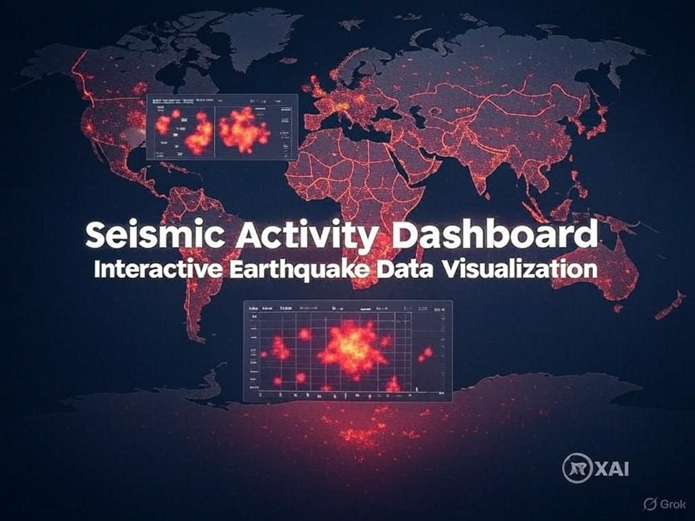

# Seismic Activity Dashboard



## Overview

The Seismic Activity Dashboard is an interactive web application built with Streamlit that provides comprehensive visualization and analysis of earthquake data. This dashboard allows users to explore seismic events over time, analyze geographical patterns, and identify trends in a highly interactive manner.

## Features

- **Interactive Filtering**: Filter data by date range, magnitude, depth, event type, and region
- **Multi-dimensional Analysis**:
  - Geographic visualization with interactive maps
  - Temporal patterns analysis (daily, weekly, hourly)
  - Statistical analysis and correlations
  - Cluster analysis using DBSCAN algorithm
- **Comprehensive Visualizations**:
  - Interactive maps (event map and heat map)
  - Time series charts
  - Distribution histograms
  - Correlation matrices
  - Heat maps for temporal patterns
- **Advanced Analytics**:
  - Trend analysis with regression lines
  - Cluster detection and analysis
  - Statistical summaries by region and magnitude category
- **Export Capabilities**: Download filtered data as CSV

## Installation

1. Clone this repository:
   ```bash
   git clone https://github.com/yourusername/seismic-dashboard.git
   cd seismic-dashboard
   ```

2. Create a virtual environment (optional but recommended):
   ```bash
   python -m venv venv
   source venv/bin/activate  # On Windows: venv\Scripts\activate
   ```

3. Install the required dependencies:
   ```bash
   pip install -r requirements.txt
   ```

## Data Requirements

The dashboard requires a CSV file named `all_month.csv` containing earthquake data with the following columns:
- `time`: Timestamp of the event
- `latitude`, `longitude`: Geographic coordinates
- `depth`: Depth in km
- `mag`: Magnitude
- `place`: Location description
- `type`: Event type classification
- Additional metadata fields (optional): `magType`, `rms`, `gap`, `horizontalError`, `depthError`, etc.

You can obtain this data from the USGS Earthquake Catalog: https://earthquake.usgs.gov/earthquakes/feed/

## Usage

1. Ensure your data file (`all_month.csv`) is in the project root directory

2. Run the Streamlit app:
   ```bash
   streamlit run app.py
   ```

3. Open your web browser and navigate to `http://localhost:8501`

## Dashboard Sections

### General Summary
Provides an overview of the seismic data with key metrics, magnitude and depth distributions, and regional activity summaries.

### Geographic Analysis
Interactive maps to visualize the spatial distribution of earthquakes, including a cluster analysis to identify geographical patterns.

### Temporal Analysis
Examine how seismic activity varies over time through daily trends, weekly patterns, and hourly distributions.

### Advanced Analysis
Deeper insights through correlation analysis, regional comparisons, and custom variable exploration.

## Dependencies

- Python 3.7+
- Streamlit
- Pandas
- NumPy
- Plotly
- Matplotlib
- scikit-learn

For a complete list of dependencies, see `requirements.txt`.

## Configuration

The dashboard is configured to work with standard USGS earthquake data format. If your data comes from a different source, you may need to modify the data loading function to match your data format.

## Customization

You can customize the dashboard by:
- Modifying color schemes in the `magnitude_colors` dictionary
- Adjusting the magnitude categories in the `conditions` and `choices` lists
- Adding new visualizations or analysis tabs

## Contributing

Contributions are welcome! Please feel free to submit a Pull Request.

1. Fork the repository
2. Create your feature branch (`git checkout -b feature/amazing-feature`)
3. Commit your changes (`git commit -m 'Add some amazing feature'`)
4. Push to the branch (`git push origin feature/amazing-feature`)
5. Open a Pull Request

## License

This project is licensed under the MIT License - see the LICENSE file for details.

## Acknowledgements

- USGS for providing open access to earthquake data
- Streamlit and Plotly for the amazing visualization libraries
- The scientific community for developing methods to analyze seismic patterns

---

*Note: This dashboard is intended for educational and research purposes only and should not be used as a primary tool for earthquake monitoring or emergency response.*